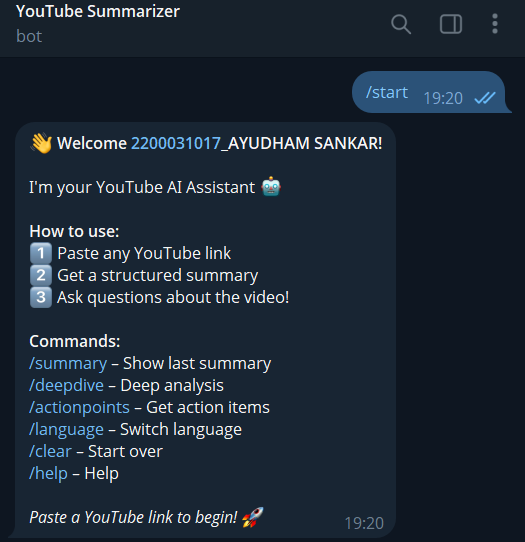
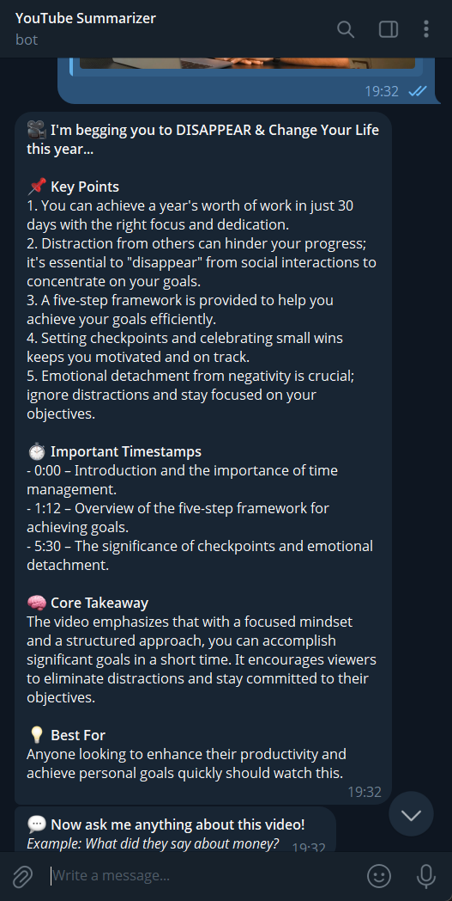
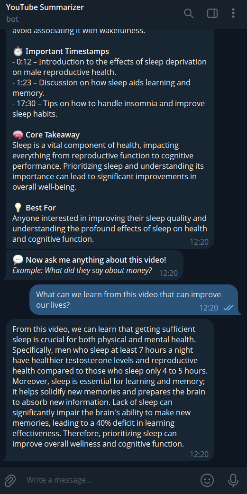
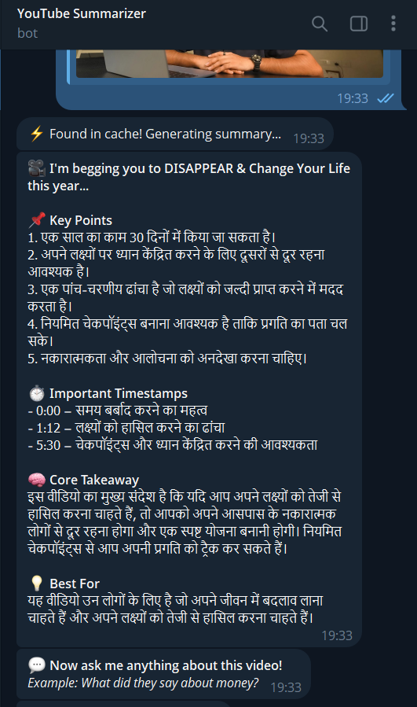
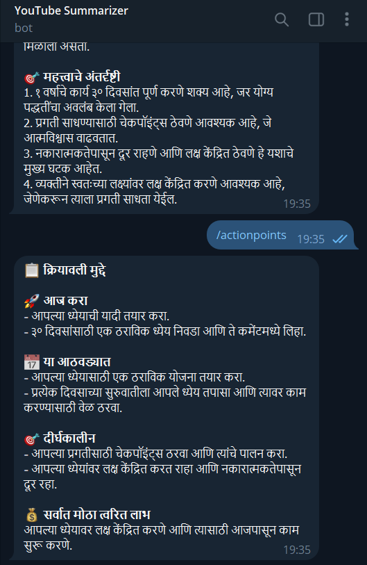

# 🤖 YouTube Summarizer & Q&A Telegram Bot

> **Eywa SDE Intern Assignment** — A smart Telegram bot that summarizes YouTube videos, enables Q&A, and supports English + Hindi using AI.


## 📸 Screenshots

### 1. Welcome Message



### 2. Video Summary



### 3. Q&A



### 4. Hindi Language Support



### 5. Action Points



---

## ✨ Features

- ✅ Paste any YouTube link → get instant structured summary
- ✅ 5 Key Points + Timestamps + Core Takeaway
- ✅ Ask unlimited follow-up questions about the video
- ✅ Answers grounded strictly in transcript — no hallucination
- ✅ Hindi language support (+ Tamil, Telugu, Kannada, Marathi)
- ✅ Smart transcript caching — same video = instant response
- ✅ Multi-user support — isolated sessions per user
- ✅ Graceful error handling — missing captions, invalid links
- ✅ Bonus commands — `/deepdive`, `/actionpoints`, `/language`

---

## 🚀 Setup Guide

### Prerequisites

| Tool    | Version |
| ------- | ------- |
| Node.js | ≥ 18    |
| Python  | ≥ 3.8   |
| yt-dlp  | latest  |

### Step 1 — Clone the repo

```bash
git clone https://github.com/sankar-ayudham/youtube-summarizer-bot.git
cd youtube-summarizer-bot
```

### Step 2 — Install dependencies

```bash
npm install
pip install yt-dlp
```

### Step 3 — Create .env file

Create a file called `.env` in the root folder:

```env
TELEGRAM_BOT_TOKEN=your_telegram_bot_token
OPENROUTER_API_KEY=your_openrouter_api_key
OPENAI_API_KEY=your_openrouter_api_key
OPENAI_BASE_URL=https://openrouter.ai/api/v1
AI_MODEL=openai/gpt-4o-mini
LOG_LEVEL=info
```

### Step 4 — Get your API keys

**Telegram Bot Token:**

1. Open Telegram → search `@BotFather`
2. Send `/newbot` → follow steps
3. Copy the token

**OpenRouter API Key (Free):**

1. Go to [openrouter.ai](https://openrouter.ai)
2. Sign up → Keys → Create Key
3. Copy the key

### Step 5 — Run the bot

```bash
npm start
```

You should see:

```
[INFO] 🤖 YouTube Summarizer Bot is running...
```

---

## 💬 How to Use

### Send a YouTube Link

```
https://www.youtube.com/watch?v=arj7oStGLkU
```

Bot replies with:

```
🎥 Video Title

📌 Key Points
1. Point one
2. Point two
3. Point three
4. Point four
5. Point five

⏱ Important Timestamps
• 0:00 – Introduction
• 3:40 – Main concept
• 8:15 – Key insight

🧠 Core Takeaway
Summary of the main lesson from the video.

💡 Best For
Who should watch this video.
```

### Ask Questions

```
What did he say about procrastination?
```

Bot answers from the transcript only. If not found, says:

```
This topic is not covered in the video.
```

### Switch to Hindi

```
Summarize in Hindi
```

---

## 📋 Commands

| Command         | Description            |
| --------------- | ---------------------- |
| `/start`        | Welcome message        |
| `/help`         | Show all commands      |
| `/summary`      | Re-show last summary   |
| `/deepdive`     | Deep analysis of video |
| `/actionpoints` | Extract action items   |
| `/language`     | Switch language        |
| `/clear`        | Clear session          |

---

## 🌐 Language Support

| Language | Trigger                |
| -------- | ---------------------- |
| English  | Default                |
| Hindi    | "Summarize in Hindi"   |
| Tamil    | "Summarize in Tamil"   |
| Telugu   | "Summarize in Telugu"  |
| Kannada  | "Summarize in Kannada" |
| Marathi  | "Summarize in Marathi" |

---

## 🏗️ Architecture

```
User (Telegram)
      │
      ▼
┌─────────────┐
│   bot.js    │  ← Entry point, command registration
└──────┬──────┘
       │
       ▼
┌──────────────────────┐
│  messageHandler.js   │  ← Routes: YouTube URL / Question / Command
└──────┬───────────────┘
       │
   ┌───┴──────────────────────┐
   │                          │
   ▼                          ▼
┌──────────────────┐   ┌──────────────────┐
│ TranscriptService│   │    AIService      │
│                  │   │                  │
│ yt-dlp           │   │ OpenRouter       │
│ → fetch VTT URL  │   │ GPT-4o-mini      │
│ → parse to text  │   │ → Summary        │
│ → timestamps     │   │ → Q&A            │
└──────┬───────────┘   │ → DeepDive       │
       │               │ → ActionPoints   │
       ▼               └──────────────────┘
┌──────────────────┐
│  SessionManager  │
│                  │
│ Per-user state   │
│ Transcript cache │
│ Language prefs   │
│ TTL: 2h sessions │
│ TTL: 24h cache   │
└──────────────────┘
```

### Key Architectural Decisions

**1. Transcript Fetching — yt-dlp**

- Uses `yt-dlp` to fetch YouTube subtitle URLs directly
- Parses VTT subtitle format into clean timestamped text
- More reliable than `youtube-transcript` npm package which gets blocked by YouTube
- Falls back gracefully if subtitles are unavailable

**2. Session Management — In-Memory Map with TTL**

- Each `chatId` gets an isolated session object
- Sessions expire after 2 hours automatically
- Transcripts cached by `videoId` for 24 hours
- Same video sent by 10 users = only 1 transcript fetch
- Trade-off: Data lost on restart → Production should use Redis

**3. Q&A — Keyword-based Chunk Selection**

- Long transcripts split into 8000 character chunks
- Most keyword-relevant chunk sent to AI for answering
- Simpler and cheaper than full vector embeddings / RAG
- Trade-off: May miss answers that span multiple chunks

**4. Language Support — Prompt Engineering**

- LLM instructed to respond entirely in the target language
- Better quality than post-translation approach
- Supports 6 languages with a single code path
- No extra API calls needed for translation

**5. AI Provider — OpenRouter**

- Uses OpenAI-compatible SDK pointed at OpenRouter base URL
- Easily swappable between GPT-4o-mini, Claude, Mistral
- Cost: approximately $0.01 per video summary
- Free tier available for testing

---

## ⚠️ Edge Cases Handled

| Edge Case                         | How Handled                       |
| --------------------------------- | --------------------------------- |
| Invalid YouTube URL               | Friendly error message shown      |
| No transcript / captions          | Clear explanation to user         |
| Private or unavailable video      | Caught at fetch stage             |
| Very long video (2h+)             | Transcript truncated start + end  |
| Q&A without video loaded          | Prompts user to send a link first |
| Topic not in video                | Bot says "not covered" explicitly |
| Expired session (2 hours)         | User prompted to re-send link     |
| Same video sent by multiple users | Served from cache instantly       |
| Rate limit from AI API            | Error caught, user asked to retry |

---

## 📁 Project Structure

```
youtube-summarizer-bot/
├── src/
│   ├── bot.js                    ← Entry point, all commands
│   ├── handlers/
│   │   ├── messageHandler.js     ← Main routing logic
│   │   └── callbackHandler.js    ← Inline button handler
│   ├── services/
│   │   ├── aiService.js          ← All LLM interactions
│   │   ├── transcriptService.js  ← YouTube transcript fetching
│   │   └── sessionManager.js     ← Session + cache management
│   └── utils/
│       ├── urlParser.js          ← YouTube URL parsing
│       ├── transcriptChunker.js  ← Long transcript splitting
│       └── logger.js             ← Logging utility
├── .env.example                  ← Environment variable template
├── .gitignore                    ← Keeps .env out of Git
├── package.json                  ← Dependencies
└── README.md                     ← This file
```

---

## 💡 Design Trade-offs

| Decision    | Chosen             | Alternative            | Reason                          |
| ----------- | ------------------ | ---------------------- | ------------------------------- |
| Transcript  | yt-dlp             | youtube-transcript npm | More reliable, less blocked     |
| Storage     | In-memory Map      | Redis / MongoDB        | Zero infra for assignment scope |
| Q&A context | Keyword chunking   | Vector embeddings      | Simpler, cheaper, good enough   |
| Language    | Prompt engineering | Translation API        | Better native output quality    |
| AI model    | GPT-4o-mini        | GPT-4 / Claude         | Cost efficient, good quality    |

---

## 🔒 Security Notes

- API keys stored in `.env` file — never committed to Git
- `.env` is listed in `.gitignore`
- Sessions are isolated per `chatId` — no cross-user data access
- No user messages or transcripts stored permanently

---

## 💰 Cost Estimate

| Action            | Approx Cost   |
| ----------------- | ------------- |
| 1 video summary   | ~$0.01        |
| 1 Q&A answer      | ~$0.002       |
| 100 summaries/day | ~$1.00        |
| Transcript fetch  | Free (yt-dlp) |

---

## 🛠️ Tech Stack

| Technology            | Purpose                     |
| --------------------- | --------------------------- |
| Node.js               | Runtime                     |
| node-telegram-bot-api | Telegram integration        |
| yt-dlp (Python)       | YouTube transcript fetching |
| openai SDK            | AI API client               |
| OpenRouter            | AI provider (GPT-4o-mini)   |
| dotenv                | Environment variables       |

---

_Built for Eywa SDE Intern Assignment by Sankar Ayudham_
